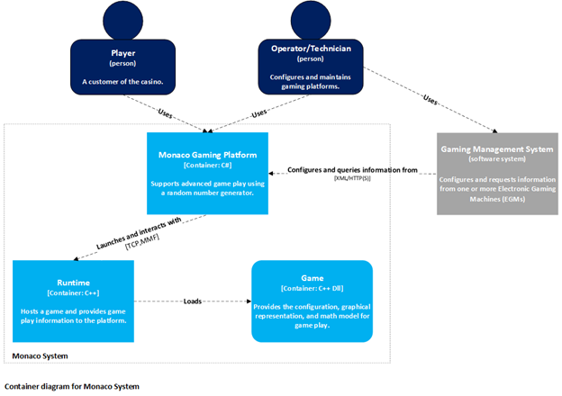
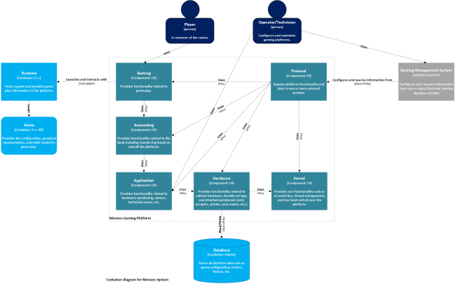
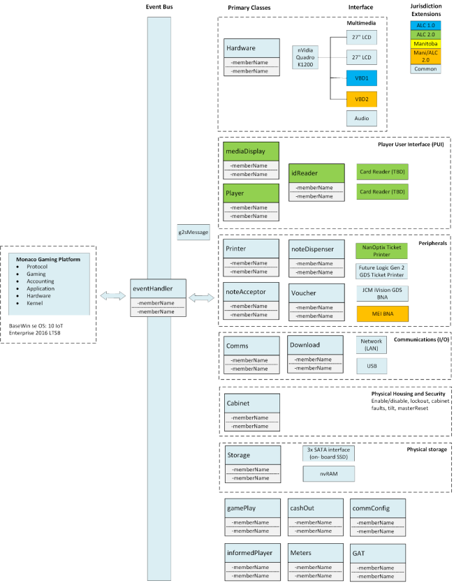
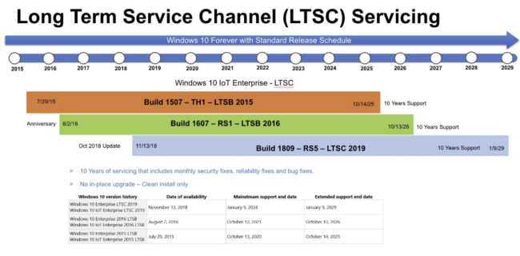

Platform System Architecture
============================

<!-- @import "[TOC]" {cmd="toc" depthFrom=1 depthTo=6 orderedList=false} -->

<!-- code_chunk_output -->

- [Overview](#overview)
- [Monaco System Context](#monaco-system-context)
- [Monaco Primary Components](#monaco-primary-components)
  - [Gaming Layer](#gaming-layer)
    - [Gaming Bootstrap](#gaming-bootstrap)
    - [Game Meter Manager](#game-meter-manager)
    - [Paytable Manager](#paytable-manager)
    - [Jackpot Handler](#jackpot-handler)
    - [Game Loader](#game-loader)
    - [Implementation Notes](#implementation-notes)
    - [Design Details and Code Examples](#design-details-and-code-examples)
  - [Accounting Layer](#accounting-layer)
    - [Accounting Bootstrap](#accounting-bootstrap)
    - [Transaction Coordinator](#transaction-coordinator)
    - [Bank Component](#bank-component)
    - [Account Register](#account-register)
    - [Accounting Layer Extensions](#accounting-layer-extensions)
      - [Transfer Types](#transfer-types)
      - [Transfer Handler](#transfer-handler)
    - [Implementation Notes](#implementation-notes-1)
    - [Design Details and Code Examples](#design-details-and-code-examples-1)
  - [Application Layer](#application-layer)
    - [Application Bootstrap](#application-bootstrap)
    - [Fault Monitoring](#fault-monitoring)
    - [Metering](#metering)
    - [System Time](#system-time)
    - [Random Number Generator](#random-number-generator)
    - [Configuration Wizard UI](#configuration-wizard-ui)
    - [Operator Menu UI](#operator-menu-ui)
    - [Application Layer Extensions](#application-layer-extensions)
      - [Device Fault Monitors](#device-fault-monitors)
      - [Network Logger](#network-logger)
      - [Tilt Logger](#tilt-logger)
    - [Implementation Notes](#implementation-notes-2)
    - [Design Details and Code Examples](#design-details-and-code-examples-2)
  - [Hardware Layer](#hardware-layer)
    - [Hardware Bootstrap](#hardware-bootstrap)
    - [Critical Memory](#critical-memory)
    - [Hardware Discovery](#hardware-discovery)
    - [Hardware Layer Extensions](#hardware-layer-extensions)
      - [Logical Device Services](#logical-device-services)
    - [Design Details and Code Examples](#design-details-and-code-examples-3)
  - [Kernel Layer](#kernel-layer)
    - [Bootstrap](#bootstrap)
    - [Logging](#logging)
    - [Add-in Manager](#add-in-manager)
    - [Service Library](#service-library)
    - [Event Bus](#event-bus)
    - [Properties Manager](#properties-manager)
    - [System Disable Manager](#system-disable-manager)
    - [PathMapper](#pathmapper)
    - [MessageDisplay](#messagedisplay)
    - [Threading and Monitoring](#threading-and-monitoring)
- [Monaco Platform Addin Extensions](#monaco-platform-addin-extensions)
  - [Adding a New Jurisdiction to Monaco](#adding-a-new-jurisdiction-to-monaco)
- [Protocol Support](#protocol-support)
    - [Design Details and Code Examples](#design-details-and-code-examples-4)
- [Random Number Generator](#random-number-generator-1)
- [Customized Windows Operating System](#customized-windows-operating-system)
  - [Specific Configuration Changes for the Monaco Windows Image](#specific-configuration-changes-for-the-monaco-windows-image)
  - [Long-Term Support Channel (LTSC)](#long-term-support-channel-ltsc)

<!-- /code_chunk_output -->

# Overview

The Monaco platform is Aristocrat's next generation of digital EGM systems for enhancing the video gaming experience. The Monaco architecture, already deployed in multiple jurisdictions, provides true multi-game support and greater flexibility to develop new features required to lead the market and attract game players.

Built using a modular Service Oriented Architecture (SOA) design running on a customized MS Windows 10 IoT Enterprise OS build, Monaco enables greater flexibility for adding new game titles, hardware, and other add-ons. The Monaco platform was first launched into Aristocrat’s Video-Lottery Terminal market (VLT) in early 2018. As of summer 2021, Monaco retail deployed in the following markets:

-   Atlantic Lottery Commission ([ALC](https://www.alc.ca/content/alc/en.html)) - Canada
-   Alberta Gaming and Lottery Commission ([AGLC](https://aglc.ca/)) - Canada
-   Manitoba Liquor and Lotteries ([MBLL](https://www.mbll.ca/)) - Canada
-   Oregon State Lottery ([OSL](https://www.oregonlottery.org/)) - USA
-   Illinois Gaming Board, Video Gaming Terminals ([IGB](https://www.igb.illinois.gov/)) - USA
-   Winners World:
    -   Americas/GLI -Nevada CIII
    -   EMEA Regulated and Unregulated
    -   APAC Unregulated

Markets under development/certification process include:

-   New York Lottery
-   Kentucky HHR
-   Winners World Enhancements 

# Monaco System Context

The Monaco platform comprises three containers (modules):

-   Monaco Gaming Platform
-   Runtime: [Overview - Monaco Platform, Runtime, and Game Binaries](https://confy.aristocrat.com/display/GTech/Overview+-+Monaco+Platform%2C+Runtime%2C+and+Game+Binaries)
-   One or more games

The **Monaco Gaming Platform** is a C# application responsible for enabling game play. This includes securely bootstrapping the Runtime, persisting all relevant data, managing peripherals, providing a user interface for players and technicians, and implementing protocols to enable communications with one or more gaming management systems.

The **Runtime** is a C++ application, which is launched by the Monaco Gaming Platform. Monaco and the Runtime exchange information over Inter-process communication (IPC) where Monaco is the server for the IPC. 

**Games** are developed by separate studios but are an integral part of the Monaco platform. The games provide the graphical representation and math model for each game.

This diagram provides context around the Monaco System. It shows the people who use it and the other software gaming management systems that the Monaco platform has a relationship with. These software systems include third-party hosts such as IGT, Scientific Games, Everi, and Ainsworth.

The Monaco platform currently supports the following host communication protocols, which will be covered in more detail in later sections:

-   G2S
-   SAS
-   Everi
-   Ainsworth

# Monaco Primary Components

The Monaco platform contains five (5) core components: **Kernel**, **Hardware**, **Application**, **Accounting**, and **Gaming**. It's important to note that while the diagram does not illustrate all usage/dependencies (for readability purposes) the higher-level components such as the Gaming component may "Use" all other components in the platform such as the Application and Kernel components. It's also important to note the direction of the "Uses" arrows. While higher-level components may use a lower-level component, a lower-level component must not use a higher-level component, which is a major architectural tenet of the Monaco architecture.

**Note:** The diagram below is G2S-centric and does not include the latest jurisdictions, peripherals, or displays:

## Gaming Layer

The Gaming layer is the top layer of the Monaco platform and provides the services and functionality for hosting games that are common to all games and not specific to any type of game. Core components in the Gaming layer include the Gaming Bootstrap, Game Meter Manager, Paytable Manager, Jackpot Handling and Game Loader. 

### Gaming Bootstrap

The Gaming Bootstrap component is the boot extender add-in for the Accounting Bootstrap. It is responsible for controlled initialization of the Gaming layer components, and registering layer services with the Service Library. The Gaming Bootstrap component then executes the Game Loader described below.

### Game Meter Manager

The Application layer contains a Meter Manager component service that provides basic functionality for providing, accessing, and modifying meters. The Game Meter Manager component is a service that provides a set of meters for a predetermined number of games. A game is identified by its title Id and paytable Id. For each game, several meters are tracked, including amount wagered, amount won, games played, and games won. The Game Meter Manager component allows a game to add meters for itself and increment those meters. Other system components can retrieve the Game Meter Manager component from the Service Library and request the set of meters for a given game.

### Paytable Manager

The Paytable Manager component is a service that is responsible for retrieving, storing, and providing paytables used by games. The Paytable Manager component defines an extension point at which paytable data sources plug in. The paytable data source implementation is responsible for providing the paytable to the Paytable Manager component, and may get the data from a local drive, or retrieve it from an external host system (IGT Intelligen, Everi, and Ainsworth), for example. Games and other system components can retrieve the Paytable Manager component from the Service library.

### Jackpot Handler

The Jackpot Handling component provides services for processing an awarded jackpot based on configuration. Various handling strategies exist and are comprised of a combination of basic elements, including how to present the jackpot, and whether to add the award to the patron balance or to do a hand pay transfer. In the latter case, the strategy may determine whether or not to print a receipt. The Jackpot Handling component provides service implementations for each strategy, where only the service for the currently configured strategy will be available via the Service Library. In addition, the Jackpot Handling component provides a service for carrying out a jackpot hand pay transfer. This component allows games to only deal with determining if a jackpot was obtained and then use a common platform service to process the jackpot based on configuration. While the jackpot concept and logical component are core to the Gaming layer, individual strategy service components and the jackpot hand pay transfer service are all extensions, because none of them are individually required. Only a subset of the services provided by the Jackpot Handling component will be in use at any given time.

### Game Loader

Once the core Gaming layer components are loaded and initialized, the Gaming Bootstrap component creates and executes the Game Loader component, which retrieves the currently selected game property indirectly from the Game Library via the Shared Data component service. The Game Loader component then executes the game and waits for it to exit. Upon game exit, the Game Loader component inspects the game’s exit-reason. If the reason is for entry into setup mode, the Game Loader component launches the Operator Menu UI, via the service provided by that component. Upon exit from the operator menu, the Game Loader re-launches the game. When the game exits with an exit-reason of "shutdown", the Game Loader terminates, commencing a systematic shutdown of each layer from top to bottom (tear down).

### Implementation Notes

-   GamingRunnable is the entry point
-   Uses SimpleInjector rather than addins
-   Very high refactor opportunity
-   Class 2: NYL potential outcomes provided, host system picks a card at random to send back to ATI. Host is deterministic.
-   Class 3: uses RNG rather than a deterministic host, uses SAS for accounting
-   Provides the following addin paths:
    -   Ticket creators
    -   Import/export machine configuration
    -   Note acceptors
    -   Game meter providers, both composite and atomic
-   Contracts:
    -   Central contains outcomes for deterministic events, class 2 only
    -   IProcessManager : GameProcessManager, passes command line params to the game process
    -   progressives live here
    -   Session, manages the game session by ending it, supports player tracking
    -   Bonus provider and handler
    -   Data objects, and the events associated with them
-   Game process starts up, loads the runtime and GDK
-   RuntimeFlags: controls whether or not gameplay can occur
-   Commands:
    -   RuntimeProxy: wrapper aound calls to the runtime
    -   GamePlayState is the state machine for the game
        -   enabled, inGameRound, Idle
        -   CurrentPlayState
        -   EscrowWager: the amount you want to bet on the game round
-   Processes are as follows:
    -   Platf
    -   Runtime + game DLL
    -   Host (Everi, G2S, SAS, etc.)
    -   Platform and Runtime talk via gRPC (formerly WCF).
-   Now uses gRPC, previously used WCF.
-   This is really Monaco: the game loads, the lobby renders, etc.
-   Biggest technical debt is the lobby: does too much, owns everything, poor model-view separation.
-   Monaco.Gaming.VideoLottery:
    -   VideoLotteryRunnable:
    -   loads the UI and the WPF lobby.
    -   controls ResponsibleGaming, etc.
-   Aristocrat.Monaco.Gaming.addin.xml:
    -   During bootup, events are fired constantly. Gaming layer registers a StartupEventListener.
    -   ImportMachineSettingsPropertyProvider allows an e-Key (USB stick) to export machine settings from an EGM and import into a different clean EGM.
    -   See &lt;NoteAcceptorDisable/Enable> to see when the bill note acceptor is disabled (e.g. while in Audit Menu, during Handpay, when a door is opened, etc.).
    -   GameCompositeMeters are defined as expressions from other meters.
-   Software updates:
    -   G2S supports remote software updates from the host and can upgrade the OS, platform, runtimes and games.
    -   SAS does not support remote software updates.
-   Edge lighting:
    -   Game owns the edge lighting so it can coordinate it with the game.
    -   When game is shut down, Platform controls edge lighting.
    -   Game writes to a MemoryMappedFile exposed by the platform; platform updates the edge lighting hardware from the MMF.
-   GamingRunnable:
    -   loads the game container and loads services (via Bootstrapper).
    -   mounts the ISOs.
-   Monaco.Gaming.Contracts:
    -   Central: interfaces related to central determination (Class 2).
    -   Process:
        -   IProcessManager: handles game startup, passing command line args, subscribing to game shutdown, etc.
    -   SPC (Special Progressive)
-   Monaco.Gaming:
    -   GameProcessArgs: loads the game DLL, paytables (variations), etc.
    -   IRuntime: contract for the Platform to communicate with the Runtime host, e.g. buttons, messages, state updates, etc.
        -   RpcClient: communicates with the Runtime via gRPC.
    -   gameService.proto
    -   RpcService (GameServiceBase) handles messages from the runtime, e.g. GetRandomNumber() generates and returns a random number requested by the game.
-   Game rounds:
    -   IGamePlayState
    -   A game round is a base game (initial win) plus any number of bonus/free games triggered by a feature win.
    -   Per-jurisdiction config to track each bonus/free game separately or with the initial game round.
-   Game idle is not a recovery state
-   Recovery Blob, associated GamePlayState, facilitates recovery
-   OutcomeFailedEvent, Class 2 only, triggers PrimaryGameRequestFailed which cleans out the current game, game escrow amount is put back into the bank
-   EndGameDelay, ensures that spamming the button doesn't actually trigger that many times
-   Commands:
    -   Inherits from ICommand
    -   Command handlers inherit from ICommandHandler&lt;&gt;
    -   BeginGameRoundAsync, pretty self explanatory, begins the game round
    -   SecondaryGameEnded, called when a secondary game has ended
    -   GamePlayDisabled and GamePlayEnabled, enables/disables the game
    -   PrimaryGameEscrowFailed, fails to completely request a game round
-   GameDelay: an amount of time immediately after the game round where action isn't permitted
-   StateMachine
    -   Configures the game states
    -   Inherits from Iservice, through IGamePlayState
    -   GamePlayState defines the order of the GameStates, what triggers will invoke them
    -   Triggers are fired the GRPC service
    -   CreateStateMachine() sets up the entire state machine for playing games.
    -   Game is in progress anytime game state is not PlayState.Idle.
    -   Handles state transitions and gRPC requests/responses to update game's parallel state machine.
-   .proto files are the contract definition for GRPC
-   Games can have multiple denom's, configured by the customer
-   ConfigureClientCommandHandler:
    -   On Handle, sets the configuration, sends it to the GDK via gRPC
    -   When game process loads, it sends a ConfigureClient command which Handle() handles here.
    -   Handle() for our response, which gives the game everything it needs to know to configure itself.
-   GetInGameMetersCommandHandler:
    -   Handle(): {gameId, denomId} uniquely identify a game paytable.
-   GameErrorCode has enums for game math errors
-   PrimaryEventHandler: base game.
-   PlayerBank: tracks player's credits.
-   GameRoundEventCommandHandler
-   ICommandHandler, e.g. ClaimJackpotCommandHandler : ICommand&lt;ClaimJackpot> shows an example of normal versus replay handling of a progressive jackpot win.
-   GetLocalStorage
    -   Updates player session data
-   GetRandomNumberCommandHandler
    -   non-CDS:
        -   Pass in a range of values, RNG will return a number from that
        -   This number is matched against a paytable
    -   CDS:
        -   This whole process is offloaded to the CDS
-   EndGameRoundCommand
    -   Triggered when the round is complete. When triggered, the game round is considered closed.
-   PayGameResultsCommandHandler
    -   handles the payout, either handpay or voucher
-   GameIdle:
    -   Ends the game history, ends recovery
    -   Issues check balance command
    -   Set allow sub game round runtime condition
-   PrimaryGameEscrow:
    -   Saves the initial wager
    -   Game tells the platform that it will request a game round
-   PrimaryGameStarted:
    -   Where the primary game is actually started, calls Wager command
-   RequestCashout:
    -   When the player hits the cashout button
    -   Fires CashOutButtonPressedEvent, which calls bank cashout
-   LobbyViewModel.cs
    -   Huge file that manages the UI state and events
-   RuntimeCondition (enum):
    -   Contains many states (InLockUp, AllowGameRound, etc)
    -   AutoCompleteGameRound: simulates the bash button to force a game, in order to complete before the end of gaming hours
    -   ServiceRequested: correlates button on the VBD, summons an attendant
    -   Set by GamePlayEnabled, GamePlayDisabled
-   RuntimeState (enum):
    -   States of the runtime (loading, recovery, pause)
    -   Running and Normal mean exactly the same thing
    -   Reconfigure: set when things like denoms are changed
-   GameRoundEventState (enum)
    -   States within the game round
-   ProgresiveController
    -   Uses ProgressiveGameProvider\\
    -   Controls progressives, sends results back to game and interacts with runtime
Commands:
-   ProgressiveGameProvider
    -   updates game history with whatever jackpots were won
-   SecondaryGameChoice:
    -   stores choices made for a secondary game
-   SecondaryGameEnded:
    -   Ends secondary game in the game history
    -   sets meters
-   SelectDenomination
    -   changes denom between rounds, if game supports it
-   Shuffle
    -   shuffles an array of values, randomly

### Design Details and Code Examples

The links below redirect to the Monaco design team's pages. **Note that some of this information is incomplete, and code examples may be out of date:**

-   [Attendant-Paid Jackpot](https://confy.aristocrat.com/display/MON/Attendant-Paid+Jackpot)
-   [Barkeeper Button](https://confy.aristocrat.com/display/MON/Barkeeper+Button)
-   [Bonus Pots](https://confy.aristocrat.com/display/MON/Bonus+Pots)
-   [Cashable lockups](https://confy.aristocrat.com/display/MON/Cashable+lockups)
-   [Central Determination](https://confy.aristocrat.com/display/MON/Central+Determination)
-   [Configuration Restrictions](https://confy.aristocrat.com/display/MON/Configuration+Restrictions)
-   [Dynamic Game Configuration](https://confy.aristocrat.com/display/MON/Dynamic+Game+Configuration)
-   [External Bonusing](https://confy.aristocrat.com/display/MON/External+Bonusing)
-   [Lobby Assets Package](https://confy.aristocrat.com/display/MON/Lobby+Assets+Package)
-   [Multi-play](https://confy.aristocrat.com/display/MON/Multi-play)
-   [Progressives](https://confy.aristocrat.com/display/MON/Progressives)
-   [Service Button](https://confy.aristocrat.com/display/MON/Service+Button)
-   [Single Game vs. Lobby](https://confy.aristocrat.com/display/MON/Single+Game+vs.+Lobby)
-   [Theoretical RTP for NV/GLI](https://confy.aristocrat.com/pages/viewpage.action?pageId=39217175)

## Accounting Layer

The Accounting layer is responsible for handling all credit transfers on to and off of the EGM. Credit transfers onto the EGM can occur from multiple sources including inserting cash and vouchers into a note acceptor device, funds transferred electronically from a wagering account, and as the result of game play. Transfers off of the EGM can occur as the result of a player cash-out, an attendant hand-pay, and transferred electronically to a wagering account. Halting the platform at the Accounting layer, one could easily develop most point-of-sale and ATM applications.

The primary components of the Accounting layer are the Bank, Transaction Coordinator, and Account Register. These components provide the capabilities needed for all types of transfers.  Extensions to the Accounting layer provide the capabilities to perform specific types of transfers, like issuing and redeeming vouchers.

### Accounting Bootstrap

The Accounting Bootstrap component is the boot extender add-in for the Application Bootstrap. It is responsible for controlled initialization of the Accounting layer components, and registering layer services with the Service Library. The Accounting Bootstrap component then executes an expected boot extender add-in.

### Transaction Coordinator

The Transaction Coordinator component is a service that provides a transaction context within which a transaction handler will perform the actions associated with a financial transaction. The primary purpose of the Transaction Coordinator is to enforce serialization of transfers of funds.

Transaction handlers request a transaction Id from the Transaction Coordinator. If there is currently no transaction in progress, the Transaction Coordinator generates a new transaction Id for the handler. If there is already a transaction in progress, the transaction Id request will be denied. The handler may then elect to enter a FIFO request queue. When the current transaction is completed, the next handler in the request queue will be allowed to begin its transaction. All transaction handlers have a unique Id.

The Transaction Coordinator is not responsible for maintaining the integrity of a transaction. It only persists the transaction Id and handler Id for the current transaction. The Ids for queued transaction requests are not persisted. Therefore it is the responsibility of the requesting transaction handler to request a transaction Id upon re-initialization in the case of a system restart.

### Bank Component

The Bank component provides a set of accounts for cashable, non-cashable, promotional and non-transferable promotional credits. The Bank provides interfaces to deposit, withdraw, and query the EGM account balances. Bank account balances are persisted to non-volatile memory in the case of a system restart. The Bank component is registered as a Property Provider for the maximum credit limit property.

The Bank component requires calls to modify account balances to contain the Id of the current transaction. The Bank will verify with the Transaction Coordinator that the Id matches the current, open transaction Id. If the Ids match, the bank operation is allowed to proceed. If the two Ids do not match, the Bank component denies the operation.

### Account Register

The Account Register component is a service that provides the capability to record transfers for later recall, as would a paper checkbook register. The Account Register provides an extension point at which a transfer type can add-in. The Account Register component creates a persisted register for each add-in transfer type. The Account Register also maintains a transfer odometer value that increments each time any transfer takes place.

### Accounting Layer Extensions

#### Transfer Types

The Monaco platform supports many types of fund transfers, some subset of which will be used in a given runtime configuration. Transfer types are add-ins that plug in to the extension point offered by the Account Register component described above. Transfer types include the following: Currency-In, Voucher-In, Voucher-Out, and Canceled-Credits.

#### Transfer Handler

For each transfer type, there is a handler that is responsible for working with the Transaction Coordinator, Bank, and device components to carry out transfers of that type. Like devices and transfer types, the presence of these handlers is configurable.

The **Currency-In Handler** component is responsible for handling the deposit of cash credits into the player’s balance on the EGM, as the result of inserting currency into a note acceptor device.

The **Voucher-In Handler** component is responsible for handling the deposit of credits into the player’s balance on the EGM, as the result of inserting a voucher into a note acceptor device.

The **Voucher-Out Handler** component is responsible for handling the withdrawal of credits from the player’s balance on the EGM, in order to issue a voucher for the same amount.

The **Canceled Credits Handler** component is responsible for handling the withdrawal of credits from the player’s balance on the EGM, in order to issue a voucher for the same amount.

The **Transfer-Out Handler** component is responsible for removing all or a specified amount of credits from the player’s balance on the EGM via the most preferred mechanism. Possibilities include electronic transfer, voucher, and canceled credits.  The transfer requestor neither specifies, nor cares which mechanism is used. If the most preferred mechanism fails, the Transfer-Out Handler tries the next most preferred mechanism.

### Implementation Notes

-   Monaco.Accounting.addin.xml
-   Various ways to transfer in/out:
    -   bills, vouchers, WAT.
    -   WAT (Wireless transfer), e.g. player inserts player card; EGM and host determines player card has credits and transfers credits to the EGM; then back to card when the player cashes out.
    -   HandpayPropertyProvider.xml determines how transactions are paid (vouchered handpays, attendent handpay (typically IRS limits), etc.); and how they're metered.
    -   keyed credits
-   All accounting meters are located under the accounting namespace
-   Ticket creators are defined here, which is tech debt
-   Uses .xml to define printable regions
-   Uses different providers, based on transaction type
-   Some jurisdictions allow vouchers to be printed during game play leading to different implementations according to jurisdiction
-   Vouchers are not 'printed' until the validation id is printed
-   Printable regions can be defined as a field of interest (validation id)
-   Ticket: any document ejected from the machine, including:
    -   receipt: has an amount
    -   voucher: something you can cash or redeem
    -   text: informational document
    -   A ticket is any document ejected from a printer.
    -   A receipt is any ticket with a monetary amount.
    -   A voucher is a receipt that you can redeem for cash.
    -   A handpay is a receipt that can be redeemed after providing your info (for IRS purposes).
    -   How tickets are created:
        -   printable\_regions.xml: define regions on the ticket to which content can be printed.
        -   Mostly for USB devices that support GDS protocol with Definable Printable Regions (DPR)
        -   Serial devices tend to have onboard templates and are less flexible.
        -   printable\_templates.xml: defines the content for each ticket region (headers, etc.).
        -   VouchableTicketCreator:
            -   sets all properties (key-value pairs) on the ticket to be fed to the printable templates.
            -   Tech debt: adding a new field is cumbersome: requires adding it here, plus in the templates and regions.
        -   PrinterAdapter.Print()
            -   Once ticket is printed, must save the transaction, update sequence number and remove credits from the bank all atomically.
            -   Only the ticket id is needed for the user to redeem the ticket (attendant can look up ticket in their host database)
-   Transfer Out:
    -   All transaction types allowed by jurisdiction are registered with the ITransferOutHandler.
        -   See Jurisdiction.addin.xml's TransactionHistoryProviders, TransferOutProviders
    -   Only one transaction can occur on the EGM at a time (indicated by TransferOutHandler.InProgress).
    -   VoucherOutProvider:
        -   Calls host to validate voucher/handpay/etc., updates database, prints ticket.
-   Credit types: CashAmount, PromoAmount, NonCashAmount. The latter two are synonymous but metered separately.
-   Non-cashable credits can be printed to a ticket and transferred to a different EGM, but not redeemed for cash.
-   Every provider runs a recovery procedure on startup in case shutdown occurs during a transaction.
-   Transactions can be queued (depending on jurisdiction). For example, OSL allows printing vouchers during game round, e.g. if the user hits the OSL $1200 limit during a gameplay (e.g. free game) rounds.
-   Vouchers: normally (outside of NYL), if anything fails, all meter increments, etc. are rolled back and transaction is aborted.
    -   Upon reboot, no stored transaction that needs to be recovered; credits still in the bank. The player can then attempt voucher again.
-   If VoucherOutProvider fails or undefined, TransferOutProvider tries the next provider, e.g. HandpayProvider.
-   HandpayProvider.HandleKeyOff() handles all KeyOffTypes.
-   Generic recovery path for a handpay:
    -   TransferOutProvider -> HandpayProvider.CanRecover(): is there an active transaction that needs to be completed.

### Design Details and Code Examples

The links below redirect to the Monaco design team's pages. **Note that some of this information is incomplete, and code examples may be out of date:**

-   [Credit Type Usage Order](https://confy.aristocrat.com/display/MON/Credit+Type+Usage+Order)
-   [Currency Support](https://confy.aristocrat.com/display/MON/Currency+Support)
-   [Jurisdictional RTP Check](https://confy.aristocrat.com/display/MON/Jurisdictional+RTP+Check)
-   [Prevent Unauthorised credit transfer from one EGM to another - NewJersey](https://confy.aristocrat.com/display/MON/Prevent+Unauthorised+credit+transfer+from+one+EGM+to+another+-+NewJersey)

## Application Layer

The Application layer provides capabilities for performing common tasks such as monitoring and handling device faults and other system faults, and providing a graphical user interface (GUI) framework for initial system configuration, and later operator use for diagnostics and configuration changes. In addition, the Application layer provides services that are common to a broad range of application types. These services include metering, random number generation, the ability to manipulate the system time, and a generic framework for routing end-user messages to the current graphics context.

Almost any application could be developed on top of the Application layer. The Kernel layer provides means of component communication. The Hardware layer provides interaction with physical devices. The Application layer provides common application capabilities.

### Application Bootstrap

The Application Bootstrap component is the boot extender add-in for the Hardware Bootstrap. It is responsible for controlled initialization of the Application layer components, and registering layer services with the Service Library. The Application Bootstrap has the added responsibility of checking if initial configuration has been completed, and if not, executing the configuration wizard prior to continuing the boot process. The Application Bootstrap component then executes an expected boot extender add-in.

### Fault Monitoring

The Fault Monitoring component is comprised of  many individual monitor components, each one responsible for monitoring a single device or fault source. Each monitor must subscribe to the notification event(s) posted by the fault source. Upon receiving a fault notification, the monitor must handle it appropriately. Possible actions include putting the system into a tilt state, turning on the tower light or bell, recording the fault in a log, and/or displaying a message to the patron or operator. Example faults include software errors, a printer running out of paper, a door opening, and critical memory corruption.

### Metering

The Metering component provides a function much like the Shared Data component in the Kernel layer. The Metering component provides access to meters, a special kind of globally shared data that often needs to be manipulated as a whole, and as individual values. Like the Shared Data component, the Metering component acts as a broker between providers and consumers. By implementing the Blackboard style, the Metering component transfers the responsibility for knowledge of all available meters from a single component to many components. Components that register as the provider of one or more meters are responsible for persisting the values of the meters they provide.

The Metering component defines two types of meters: atomic and composite. An atomic meter’s value may be both read and incremented. A composite meter’s value is calculated as an expression of one or more other meters. Therefore, a composite meter’s value may be read, but not incremented. The Metering component offers an extension point for composite meter add-ins, allowing them to be defined in configuration files, in addition to within meter-providing components.

### System Time

The System Time component is a service that allows other system components to set the current operating system clock. It also allows system components to set the application time zone. While the operating system will always run in UTC (Universal Time Coordinated), the application may want to display dates and times to end users in the local time zone. The System Time component shares the application time zone as data via the Shared Data service. The System Time component provides a method to convert a given UTC date/time value to the current application time zone.

### Random Number Generator

The Random Number Generator (RNG) component is a service that allows system components to request a random number. The RNG component is responsible for implementing an algorithm for generating random numbers, generating the initial entropy to seed the algorithm, and regularly exercising the algorithm to ensure that the current position within its sequence cannot be determined.

### Configuration Wizard UI

The Configuration Wizard UI component provides a pluggable framework for building a GUI that walks a user through first time system setup. The component offers an outer frame with navigation controls, as well as an extension point at which wizards can add-in. Any wizard can be comprised of one or more pages.

### Operator Menu UI

The Operator Menu UI component provides a pluggable framework for building a GUI to allow operators to view and modify configuration and historical information. The component offers an initial screen on which sub-menus can plug-in through an extension point. Each menu can be comprised of one or more pages. The component includes a service to allow system components to launch the GUI and enter setup mode.

### Application Layer Extensions

#### Device Fault Monitors

While the Fault Monitoring concept and some of the individual monitors described in section are core Application layer components, many fault monitors are tasked with monitoring optional devices. These device components are optional extensions in the Hardware layer. Their corresponding fault monitors are optional extensions in the Application layer.

#### Network Logger

The Network Logger is an Application layer extension. The Network Logger provides a mechanism for logging data to a specific logger as provided by the Kernel layer.

#### Tilt Logger

The Tilt Logger component is a service that allows other system components to disable and re-enable the system in response to detected error conditions. The Tilt Logger maintains the system state and notifies system components by posting state change events to the Event Dispatcher.

The table below lists Monaco events (as built for the **AGLC 2.2** market, other markets may differ slightly, for example NYL, which requires a card reader peripheral):

<table>
  <colgroup>
    <col style="width: 50%" />
    <col style="width: 49%" />
  </colgroup>
  <thead>
    <tr class="header">
      <th colspan="2"><strong>Tilt Event – EGM Lockup</strong></th>
    </tr>
  </thead>
  <tbody>
    <tr class="odd">
      <td>Handpay.HandpayStartedEvent</td>
      <td>KeySwitch.EnabledEvent</td>
    </tr>
    <tr class="even">
      <td>TransferOutFailedEvent</td>
      <td>KeySwitch.OffEvent</td>
    </tr>
    <tr class="odd">
      <td>OperatorMenuEnteredEvent</td>
      <td>KeySwitch.OnEvent</td>
    </tr>
    <tr class="even">
      <td>OperatorMenuExitedEvent</td>
      <td>KeySwitch.KeyHeldEvent</td>
    </tr>
    <tr class="odd">
      <td>DiskSpaceEvent</td>
      <td>NoteAcceptor.DisabledEvent</td>
    </tr>
    <tr class="even">
      <td>DiskSpaceClearEvent</td>
      <td>NoteAcceptor.EnabledEvent</td>
    </tr>
    <tr class="odd">
      <td>NoteAcceptorDocumentCheckClearedEvent</td>
      <td>NoteAcceptor.ResetEvent</td>
    </tr>
    <tr class="even">
      <td>NoteAcceptorDocumentCheckOccurredEvent</td>
      <td>Printer.DisabledEvent</td>
    </tr>
    <tr class="odd">
      <td>SystemDisabledByOperatorEvent</td>
      <td>Printer.EnabledEvent</td>
    </tr>
    <tr class="even">
      <td>SystemEnabledByOperatorEvent</td>
      <td>Printer.HardwareWarningEvent</td>
    </tr>
    <tr class="odd">
      <td>GameConfigurationMismatchEvent</td>
      <td>Printer.HardwareWarningClearEvent</td>
    </tr>
    <tr class="even">
      <td>GameResetTiltEvent</td>
      <td>Printer.InspectionFailedEvent</td>
    </tr>
    <tr class="odd">
      <td>GameResetTiltClearEvent</td>
      <td>PlatformBootedEvent</td>
    </tr>
    <tr class="even">
      <td>Door.DisabledEvent</td>
      <td>SystemDisabledEvent</td>
    </tr>
    <tr class="odd">
      <td>Door.EnabledEvent</td>
      <td>SystemEnabledEvent</td>
    </tr>
    <tr class="even">
      <td>Door.OpenEvent</td>
      <td>G2S.Common.Events.HostUnreachableEvent</td>
    </tr>
    <tr class="odd">
      <td>Door.ClosedEvent</td>
      <td>TouchDisplayConnectedEvent</td>
    </tr>
    <tr class="even">
      <td>IO.DisabledEvent</td>
      <td>TouchDisplayDisconnectedEvent</td>
    </tr>
    <tr class="odd">
      <td>IO.EnabledEvent</td>
      <td>Jackpot.ProgressiveFaultEvent</td>
    </tr>
    <tr class="even">
      <td>KeySwitch.DisabledEvent</td>
      <td>Jackpot.ProgressiveFaultClearEvent</td>
    </tr>
    <tr class="odd">
      <td colspan="2"><strong>Error Event – EGM Lockup</strong></td>
    </tr>
    <tr class="even">
      <td>LegitimacyLockUpEvent</td>
      <td>NoteAcceptor.HardwareFaultClearEvent</td>
    </tr>
    <tr class="odd">
      <td>Button.DisabledEvent</td>
      <td>NoteAcceptor.InspectionFailedEvent</td>
    </tr>
    <tr class="even">
      <td>HardMeter.StoppedRespondingEvent</td>
      <td>PersistentStorageIntegrityCheckFailedEvent</td>
    </tr>
    <tr class="odd">
      <td>IO.ErrorEvent</td>
      <td>Printer.DisconnectedEvent</td>
    </tr>
    <tr class="even">
      <td>IO.InspectionFailedEvent</td>
      <td>Printer.ConnectedEvent</td>
    </tr>
    <tr class="odd">
      <td>NVRam.DisabledEvent</td>
      <td>G2S.Common.Events.TransportDownEvent</td>
    </tr>
    <tr class="even">
      <td>NVRam.EnabledEvent</td>
      <td>Printer.HardwareFaultEvent</td>
    </tr>
    <tr class="odd">
      <td>NVRam.ErrorEvent</td>
      <td>Printer.HardwareFaultClearEvent</td>
    </tr>
    <tr class="even">
      <td>NVRam.InitFailedEvent</td>
      <td>Printer.ResolverErrorEvent</td>
    </tr>
    <tr class="odd">
      <td>NVRam.InspectionFailedEvent</td>
      <td>Audio.DisabledEvent</td>
    </tr>
    <tr class="even">
      <td>NVRam.LowRamBatteryEvent</td>
      <td>Printer.TransferStatusEvent</td>
    </tr>
    <tr class="odd">
      <td>NVRam.LowRamBatteryIntermediateEvent</td>
      <td>Printer.LoadingRegionsAndTemplatesEvent</td>
    </tr>
    <tr class="even">
      <td>NVRam.LowRamBatteryIntermediateClearedEvent</td>
      <td>GameFatalErrorEvent</td>
    </tr>
    <tr class="odd">
      <td>NoteAcceptor.DisconnectedEvent</td>
      <td>DisplayConnectedEvent</td>
    </tr>
    <tr class="even">
      <td>NoteAcceptor.ConnectedEvent</td>
      <td>DisplayDisconnectedEvent</td>
    </tr>
    <tr class="odd">
      <td>NoteAcceptor.HardwareFaultEvent</td>
      <td></td>
    </tr>
    <tr class="even">
      <td colspan="2"><strong>Information Event – Logging Only</strong></td>
    </tr>
    <tr class="odd">
      <td>VoucherIssuedEvent</td>
      <td>G2S.Common.Events.TransportUpEvent</td>
    </tr>
    <tr class="even">
      <td>VoucherReprintRequestEvent</td>
      <td>GameEnabledEvent</td>
    </tr>
    <tr class="odd">
      <td>CashOutButtonPressedEvent</td>
      <td>GameDisabledEvent</td>
    </tr>
    <tr class="even">
      <td>HardMeter.StartedRespondingEvent</td>
      <td>GameDenomChangedEvent</td>
    </tr>
    <tr class="odd">
      <td>Audio.EnabledEvent</td>
      <td></td>
    </tr>
  </tbody>
</table>

### Implementation Notes

-   Loaders load a view and associated viewmodel, e.g. EdgeLightingLoader.
-   ApplicationRunnable is the entry point:
    -   Maps the mono paths and starts the specififed runnables.
    -   loads the jurisdiction's Jurisdiction.addin.xml, which controls the custom config pages, etc.
    -   Think of Monaco as an ATM that plays video games (thanks, Cory)
    -   Monaco.Application.addin.xml: Mono add-on definition: dependencies (e.g. bootstrap), services, ticket creators, etc.
    -   See <https://www.mono-project.com/archived/introduction_to_monoaddins/#the-extension-model> for an intro to Mono Add-ins.
-   IdProviders: several kinds
-   CabinetMeters
    -   tracks door openings, events that happen to the cabinet
-   TiltLogger
    -   logs events
    -   limits are defined in xml
-   Operating hours service
-   Authentication
    -   supports multiple hashing algorithms
    -   OS hashing is supported
    -   secure boot chain
    -   hash checks occur after cabinet doors shut, when retail systems are started, etc
    -   The BIOS, OS and all components are verified against tampering.
    -   AuthenticationService registers and hashes components.
    -   LiveAuthenticationManager uses AuthenticationService.
    -   Eventually everything calls AuthenticationService.CalculateHash which hashes the component.
    -   This is why a retail boot takes 8-10 minutes.
    -   A hardware device is also involved during the secure boot process. Jim Helm and Thomas Rizos will know more.
-   Localization
    -   PlayerCultureProvider.
    -   The platform (audit menu, etc.) can be configured to use one language (vouchers, etc.).
    -   The player can select a different language for the game, cash-out vouchers, etc.
-   Metering:
    -   MeterManager registers MeterProviders, like a PropertyManager specifically for meters.
    -   IMeter: AtomicMeter, CompositeMeter, DummyMeter, etc.
    -   CompositeMeter is a function of other meters, e.g. a total of all currency notes and vouchers.
    -   MeterManager manages MeterProviders, which each manage a set of Meters.
    -   MeterManager looks up meters (and their providers) by their fully qualified name.
    -   not a Mono add-in (no XML); hard-coded.
    -   Cabinet meters are mostly related to power on/off, doors, etc.
    -   e.g. CabinetMeterProvider manages the cabinet meters.
    -   Composite meters can be nested.

-   Monitors
    -   Aristocrat.Monaco.Application.Monitors:
        -   Monitors track changes in state for lower-level devices and applies business logic.
        -   This separates business logic from devices' raw events.
        -   e.g. NoteAcceptorMonitor handles bus malfunction, and report events to the platform, so e.g. it can lockup.
        -   TiltLogger and jurisdictions' TiltLogger.config.xml control the rollover limits for various event types logged to the database (nvram.sqlite), e.g. &lt;EventType Type="Error" Max="100">.
        -   BatteryMonitor
        -   AuditTicketMonitor
        -   DiskSpaceMonitor
        -   HardMeterMonitor communicates with a hard (physical) meter and is audited against the Platform's (Audit Menu's) meters.
        -   Monitors are a good example of a minimalist IService implementation.

### Design Details and Code Examples

The links below redirect to the Monaco design team's pages. **Note that some of this information is incomplete, and code examples may be out of date:**

-   [Displayable Message Updates](https://confy.aristocrat.com/display/MON/Displayable+Message+Updates)
-   [Lockup messages for translation](https://confy.aristocrat.com/display/MON/Lockup+messages+for+translation)
-   [Multi-Language Support](https://confy.aristocrat.com/display/MON/Multi-Language+Support)
-   [Player User Interface (PUI)](https://confy.aristocrat.com/pages/viewpage.action?pageId=34271212)
-   [Software Validation](https://confy.aristocrat.com/display/MON/Software+Validation)

## Hardware Layer

The Hardware layer provides services for interacting with devices connected to the EGM. The primary core components of the Hardware layer are the Hardware Bootstrap, Critical Memory, and Hardware Discovery components. The Hardware Bootstrap component controls the initialization of the Hardware layer. Critical Memory is used to read and write critical system data to persistent storage devices (see also the [Accessing Persistent Storage Database](https://confy.aristocrat.com/pages/createpage.action?spaceKey=MON&title=Accessing+Persistent+Storage+Database&linkCreation=true&fromPageId=30646323) section). The Hardware Discoverer component initializes logical device services for each type of device connected to the EGM. These devices are optional, thus the logical device services are extensions to the Hardware layer.

### Hardware Bootstrap

The Hardware Bootstrap component is the boot extender add-in for the Kernel Bootstrap. It is responsible for controlled initialization of the Hardware layer components, and registering layer services with the Service Library. The Hardware Bootstrap component then executes an expected boot extender add-in.

The Boot Extender is one of the primary core component of the Hardware layer. The Hardware Bootstrap component controls the initialization of the Hardware layer. The Boot Extender is responsible for loading components and extensions in the Hardware layer, extends from the Bootstrap of the Kernel layer, and acts as an entry point in the Hardware layer. The major functions of the Boot Extender include:

-   Loads the Hardware Discoverer and makes it run in the background in a separate thread, which is implemented as an add-in Architectural model.
-   It waits till persisted storage (NVRAM) is discovered.
-   Searches the provided path for Service add-ins, instantiates those add-ins and passes them to the Service Manager to run and maintain.
-   Checks if the security dongle is attached to this terminal. It is mandatory to have Security Dongle in place, else the boot extender will simply exit the process by stopping the runnables and unloading the services.
-   Then it searches runnable add-ins, instantiates those add-ins and runs them in background. The add-in descriptions are represented using an XML manifest (HardwareBootstrap.Addin.xml).
-   Subscribes to Persistent Storage Clear StartedEvent, which signals that the hardware layer should shut down all its higher layers, perform a persistent storage clear, and restart.

### Critical Memory

The Critical Memory component manages and provides access to the, non-volatile random access memory (NVRAM), electrically erasable programmable read only memory (EEPROM), and other persistent storage devices. It is responsible for ensuring the integrity of the data stored in Critical Memory by detecting and reporting memory errors. The Critical Memory component is also responsible for implementing the data management scheme that allows system components to store and later retrieve their data.

### Hardware Discovery

Hardware Discovery is responsible for maintaining configuration information for attached devices, including device type, manufacturer, model number, firmware revision, port and more. Hardware Discovery initializes logical device services for each attached device type, and registers those services with the Service Library. While the Hardware Discoverer is a core Hardware layer component, the attached devices and their services are optional extensions.

### Hardware Layer Extensions

#### Logical Device Services

The VLT platform supports several different types of devices that attach through several different types of connections, including serial, USB, and digital I/O. Typical VLT platform devices include the following:

|EEPROM|Buttons|Audible Bells|
|--- |--- |--- |
|NVRAM (SSD, CFast)|Reels|Card Readers|
|Key Switches|Printers|Hardware Meters|
|Lights|Note Acceptors|High-quality Audio|

There exists a logical device interface for each type of peripheral device and a service implementation for each interface. The services are available via the Service Library.

There may be a separate device controller component for each unique model of a given device type. The controller knows how to work with that specific device model’s driver and/or protocol. However, there will be only one logical device service for a device type.  The logical device service works with the loaded device controller and provides additional context logic expected by the other system components. For example, if the voucher printer is disabled, and another component tries to print, the logical printer service knows to deny the print request.

### Design Details and Code Examples

The links below redirect to the Monaco design team's pages describing the various hardware supported. **Note that some of this information is incomplete, and code examples may be out of date:**

-   [Cabinet Identification](https://confy.aristocrat.com/display/MON/Cabinet+Identification)
-   [Edgelighting](https://confy.aristocrat.com/display/MON/Edgelighting)
-   [Peripheral Devices](https://confy.aristocrat.com/display/MON/Peripheral+Devices)
-   [Power Loss Note & Voucher Validation](https://confy.aristocrat.com/pages/viewpage.action?pageId=68509041)
-   [Storage](https://confy.aristocrat.com/display/MON/Storage)
-   [Tower Lights](https://confy.aristocrat.com/display/MON/Tower+Lights)

## Kernel Layer

The Kernel layer provides the architectural framework, the building blocks for the Monaco platform. It provides the all of the core system components that make up the inter-component communications framework. The Kernel layer is also responsible for the systematic startup and shutdown of the EGM.

The primary components included in the Kernel layer are the Service Library, Event Dispatcher, Shared Data, and Add-in Manager components. These components form the architecture framework for the Monaco platform. The framework aids development of the system in a manner that is consistent with the Monaco platform architectural style and helps to ensure the integrity of the architecture when future capabilities and requirements are integrated into the platform. Domain and gaming components use these three means of interaction to provide access to hardware devices, metering, accounting, an operator interface, and other jurisdiction-specific software features.

### Bootstrap

The Bootstrap component is the entry point of the platform. It is responsible for initializing the core components and extensions in the Kernel layer, and registering Kernel services with the Service Library. The Bootstrap component then executes an expected boot extender add-in. The Bootstrap component is also responsible for performing a controlled shutdown of the system.

### Logging

The Logging component provides a means for recording information, warnings, and errors. It also provides the ability for components to choose one or more output targets and defines logging levels to allow components to categorize and filter log output.

### Add-in Manager

The Add-in Manager component enables add-in architectural support and provides a standard framework for add-in definition and discovery. System components use the Add-in Manager to identify and gain access to components that are implemented as add-ins to the system. The AddinHelper class provides a service for other components to use that allows them to retrieve add-ins as filtered by the currently selected configuration property. If no selection has been made, then the results returned are unfiltered directly from the AddinManager.

### Service Library

The Service Library component manages and provides access to component services by implementing the like-named component of the service oriented architectural style. This provides a standard mechanism for one component to use the services/functions of another component. Components that provide public interfaces will also implement the service interface and be registered with the service manager. The service consumer is dependent only on the public interfaces and decoupled from the service provider implementation.

**Note:** The Service Library will be deprecated during a future release.

### Event Bus

The kernel event interface allows components to subscribe to and retrieve events based on event type. All subscribers must cancel their event subscriptions when they are no longer needed. Subscribers can call Unsubscribe() for each subscribed event type, or call UnsubscribeAll(). Subscribers should expect that their event queue will be destroyed once all subscriptions are canceled, even if the queue not empty. The Monaco platform uses a simple subscribe/publish event handling mechanism that simplifies inter-process communication and minimizes the amount of thread activity.

### Properties Manager

The Properties Manager component provides access to globally accessible information, such as system and component properties, system state, and configuration data. The Properties Manager component is a service that provides a central location for accessing information without being dependent the owner of the information. Data publishers register data with the Properties Manager component. Data users request data from the Data Manager, which retrieves it from the owning data publisher. Data publishers control the mutability of the data they expose.

### System Disable Manager

The System Disable Manager component is a service that allows other system components to disable and re-enable the system in response to detected error conditions. The System Disable Manager maintains the system state and notifies system components by posting state change events to the Event Dispatcher.

### PathMapper

The PathMapper component is a service that allows other system components to look up the absolute file system path by providing a relative, virtual path. It provides a mechanism for mapping a Monaco platform relative path to a file system absolute path.

### MessageDisplay

The MessageDisplay component is a service that registers and manages and message display handlers, routes commands to display, and removes messages from the display handler .The service decouples the source of the message from the displayer of the message.

### Threading and Monitoring

The threading component is base runnable and acts as a message pump during run and on stop, providing a way to create a thread and keep it consistent. To do so, you must keep the thread active. The thread monitor is not currently used in the Monaco platform.

# Monaco Platform Addin Extensions

The Monaco platform utilizes Mono.Addins to support extension points and plugin extensions.  Extension points are associated with a virtual path the application can query extension points at runtime to discover and load deployed extensions.  Both extension points and extensions are defined within “addins” which are defined in XML files.

Further addin details can be found at:

-   [Monaco Addin Configuration](https://confy.aristocrat.com/display/MON/Monaco+Addin+Configuration)

## Adding a New Jurisdiction to Monaco

-   [How To Add A Jurisdiction To Monaco](https://confy.aristocrat.com/display/MON/How+To+Add+A+Jurisdiction+To+Monaco)

# Protocol Support

### Design Details and Code Examples

The links below redirect to the Monaco design team's pages describing the various protocols, state diagrams, and code examples. **Note that some of this information is incomplete, and code examples may be out of date:**

-   [G2S Protocol Support](https://confy.aristocrat.com/display/MON/G2S+Protocol+Support)
-   [SAS](https://confy.aristocrat.com/display/MON/SAS)
-   [DACOM/ASP5000](https://confy.aristocrat.com/pages/viewpage.action?pageId=57846287)
-   [Everi](https://confy.aristocrat.com/display/MON/Everi)
-   Ainsworth

# Random Number Generator

The link below redirects to the Monaco design team's pages describing the RNG:

-   [Monaco Random Number Generator (RNG)](https://confy.aristocrat.com/pages/viewpage.action?pageId=7918342)

# Customized Windows Operating System

The Monaco platform runs on top of a customized build of the [Windows 10 IoT Enterprise 2019 LTSC (Windows Build 1809)](https://confy.aristocrat.com/pages/viewpage.action?pageId=57837023) base image. The current customized build is [OS Image Version 2.1.0.4 - Monaco](https://confy.aristocrat.com/display/MON/OS+Image+Version+2.1.0.4). For each OS Image there are two .wim files, one for use in development images and one for use in release (retail) images. Below is the high-level changes and structure of a Monaco OS image:

-   Create primary media partitions ([Monaco Platform Media Layout](https://confy.aristocrat.com/display/MON/Monaco+Platform+Media+Layout))
    -   Secure Boot Loader, Master Boot Record (MBR), and Reserved Space
        -   Contains the partition table, the Monaco Secure boot loader (GRUB), and various signatures
    -   Windows Boot Partition
        -   Contains the Windows boot loader. This is specific to the Windows OS installed on to the Windows OS Partition.
    -   Windows OS Partition
        -   Contains the Windows operating system configured for use with the Monaco platform, also contains three specific Aristocrat folders:
            -   **C:\\Aristocrat-VLT-Shell** - This tool is part of the secure boot chain. It will execute various tools to ensure proper Windows configuration as well as the Monaco forensic tool that will validate and execute USB Thumb Drive commands. After those items are finished it will then execute the Platform Launcher.
            -   **C:\\Aristocrat-VLT-Platform-Launcher** - This tool is part of the secure boot chain. It will validate all the files and folders on the data partition, including the Monaco Platform .ISO, before launching Monaco platform.
            -   **C:\\Aristocrat-VLT-Tools** - This folder contains secure tools that are used to configure Windows or execute USB Thumb Drive commands. It also contains various public keys used by these tools as well as by the Monaco platform.
    -   Monaco Data/Package Partition
        -   Contains the Monaco Platform, Runtime Host, and Game files. The Logs, Databases, etc. files are always located on this partition. All files on this partition are validated by the Platform Launcher upon each boot. There are two Aristocrat folders:
            -   **D:\\Aristocrat-VLT** - The Monaco platform in its entirety. This includes the Platform, Runtime Host(s), and Games (Except when using certain dual media configurations), along with the Log files, Databases, etc.
            -   **D:\\WindowsEventLogs** - Contains three Windows event logs that can be used for diagnosing problems with the Windows operating system.
            -   **DEVELOPMENT BUILDS ONLY:** Contains the above folders as well as a few others that are only used during the development process.

<!-- -->

-   -   Monaco Security Partition **(RETAIL ONLY)**
        -   Contains at least one full copy of the Windows boot partition and the Windows OS partition. For images that support upgrading the Windows operating system this will contain multiple copies of both partitions.
    -   Un-allocated Drive Space **(RETAIL ONLY)**
        -   Contains the signatures used by the Monaco secure boot loader to validate both the Windows boot partition and the Windows OS partition.
-   Create secondary media partition
    -   Monaco Data or Package Partition used in Monaco platform dual-media configurations. Contains one folder:
        -   **E:\\Aristocrat-VLT** - Contains either the Packages or Critical Data depending upon which dual-media configuration is used.
-   Shrink the overall image size to optimize memory footprint and system performance.
-   Remove unnecessary Windows utilities.

## Specific Configuration Changes for the Monaco Windows Image 

During the deployment set up, the following tasks occur:

**Generic configurations (Both Development and Release configurations):**

1.  Configure Windows Local Group Policy
2.  Configure Windows event logs
3.  Configure Windows power and hibernate settings
4.  Configure Windows Firewall
5.  Disable Windows Defender
6.  Configuring Windows Storage Sense
7.  Disable the UAC
8.  Disable IPv6 on Network Adapters
9.  Configure auto logon for user mk7
10. Set the computer name to Aristocrat-Monaco
11. Install Windows Product Key
12. Disable Windows automatic updates
13. Disable Windows recovery (This is now done in the 'Build-Monaco-Drive.ps1' Script
14. Enable proper ciphers to support SSL with IGT Host
15. Suppress all Microsoft and Windows branding
16. Disable Windows reporting and telemetry (As much as possible)
17. Disable Windows dialogs and pop-ups (As much as possible)
18. Disable the Windows page file on all drives
19. Configure Windows crash dump settings for important applications
20. Configure Windows time and time zone settings
21. Configure Windows visuals for best performance
22. Configure Windows touch related settings
23. Configure Windows Explorer settings
24. Disable NTFS Last Access Timestamps
25. Disable System Restore on all drives
26. Disable Cortana
27. Disable OneDrive
28. Disable Windows Scheduled Tasks
29. Disable Windows Services that aren't needed by the Monaco platform
30. Configure Windows Optional Features

**Release-specific configurations:**

1.  Activate the Monaco Shell
2.  Disable access to the Windows Task Manager
3.  Install Aristocrat Monaco mouse pointer scheme and activate it

**Development-specific configurations:**

1.  Setup SMB Shares for each partition
2.  Enable Remote Desktop

## Long-Term Support Channel (LTSC)

Per Microsoft, Windows 10 IoT Enterprise LTSC version is on a 10-year support plan ending 1/9/29, which includes security updates and cumulative Windows updates. However, the next (2021/2022) release will drop to a 5-year support plan.

