Steps for Building and Running the Monaco Platform
==================================================

<!-- @import "[TOC]" {cmd="toc" depthFrom=1 depthTo=6 orderedList=false} -->

<!-- code_chunk_output -->

- [Set Up Intranet Services](#set-up-intranet-services)
- [Tools](#tools)
- [Daily Builds and Running Builds on the TeamCity Server](#daily-builds-and-running-builds-on-the-teamcity-server)
  - [Build and Release Versioning](#build-and-release-versioning)
- [Building and Running Monaco Locally](#building-and-running-monaco-locally)
  - [Setup Video](#setup-video)
  - [Checkout and Build the Platform](#checkout-and-build-the-platform)
  - [Known Platform Build Issues and Workarounds](#known-platform-build-issues-and-workarounds)
  - [Download Runtime and Game(s)](#download-runtime-and-games)
  - [Set Up the Platform on Local Machine (virtual EGM)](#set-up-the-platform-on-local-machine-virtual-egm)
  - [Run the Platform on Local Machine (virtual EGM)](#run-the-platform-on-local-machine-virtual-egm)
  - [Reset the Platform](#reset-the-platform)
- [Set Up and Run on Real EGM Hardware](#set-up-and-run-on-real-egm-hardware)
  - [Install VNC Client on Local PC](#install-vnc-client-on-local-pc)
  - [Remote Desktop into EGM using VNC](#remote-desktop-into-egm-using-vnc)
  - [Download to the EGM and Run the Monaco Platform](#download-to-the-egm-and-run-the-monaco-platform)
    - [Download from TeamCity](#download-from-teamcity)
  - [Run the Platform](#run-the-platform)
  - [Troubleshooting and Typical Commands](#troubleshooting-and-typical-commands)
    - [HELP! I can't get passed touch calibration](#help-i-cant-get-passed-touch-calibration)
    - [After remoting into EGM, no desktop icons are shown, everything is black](#after-remoting-into-egm-no-desktop-icons-are-shown-everything-is-black)
    - [After Pressing "Connect" in VNC Viewer, nothing happens](#after-pressing-connect-in-vnc-viewer-nothing-happens)
- [JIRA/TXM Ticket Lifecycle](#jiratxm-ticket-lifecycle)
  - [Start the Ticket and Topic Branch](#start-the-ticket-and-topic-branch)
  - [Fix and Update the Topic Branch](#fix-and-update-the-topic-branch)
  - [Raise and Resolve the Code Review](#raise-and-resolve-the-code-review)
  - [Commit to the Parent Branch](#commit-to-the-parent-branch)
  - [Merge to Other Affected Branches](#merge-to-other-affected-branches)
  - [Finish the Jira](#finish-the-jira)

<!-- /code_chunk_output -->

## Set Up Intranet Services

Once you are hired in and have VPN access, request access to the required services below, then ask [Cory Mayberry](https://confy.aristocrat.com/display/~cmayberr) for direction on the remaining services, as you probably won't need them initially.

Most of our tools use single-sign on credentials, so you'll use your employee code, e.g. *gg105273*, as your username for all of these services unless otherwise noted.

<table>
  <colgroup>
    <col style="width: 17%" />
    <col style="width: 11%" />
    <col style="width: 70%" />
  </colgroup>
  <thead>
    <tr class="header">
      <th><strong>Service</strong></th>
      <th><strong>Use</strong></th>
      <th><strong>Notes</strong></th>
    </tr>
  </thead>
  <tbody>
    <tr class="odd">
      <td><a href="https://jerry.aristocrat.com/">Jira</a></td>
      <td>Required</td>
      <td>
        <ol type="1">
          <li>
            

              Email I.T. and ask for access to Jira group
              "secu-p-jira-lbtechdev", copying Steve Lee for authorization.
            

          </li>
          <li>
            

              Then, ask <a href="https://confy.aristocrat.com/display/~jl103722"
                >Josh Lauer</a
              > or another colleague to share their filters and dashboards, or
              learn to build your own at <a
                href="https://confluence.atlassian.com/jiracore/blog/2015/08/5-steps-to-a-killer-jira-dashboard"
                >Five Steps to a Killer Jira Dashboard</a
              >.
            

          </li>
        </ol>
      </td>
    </tr>
    <tr class="even">
      <td>
        <a href="https://confy.aristocrat.com/display/MON/Monaco">Confluence</a>
      </td>
      <td>Required</td>
      <td>
        Ask <a href="https://confy.aristocrat.com/display/~dwestbro"
          >Dietrich Westbrooks</a
        > first. If he can't grant you access, email I.T. and copy your manager
        for authorization, then verify access via your browser.
      </td>
    </tr>
    <tr class="odd">
      <td>
        <a
          href="http://usan-abuild-01.dev.local:8080/aristocrat-vlt-platform-all-branches"
          >UpSource</a
        >
      </td>
      <td>Required</td>
      <td>
        
1) login to UpSource

        

          2) Contact <a href="https://confy.aristocrat.com/display/~dwestbro"
            >Dietrich Westbrooks</a
          > for access, then verify via your browser.
        

      </td>
    </tr>
    <tr class="even">
      <td><a href="http://usan-abuild-01.dev.local/login.html">TeamCity</a></td>
      <td>Required</td>
      <td>
        <ol type="1">
          <li>
Email I.T. and copy Steve Lee for authorization.
</li>
          <li>
            

              Click the <a href="http://usan-abuild-01.dev.local/ntlmLogin.html"
                >Log in using Microsoft Windows domain</a
              > link on the login page, and use your employee code as the
              username, e.g. <em>gg105273.</em>
            

          </li>
          <li>
            

              In <em>Profile &gt; General</em>, enter your name and Aristocrat
              email address.
            

          </li>
          <li>
            

              Then in <em
                >Profile &gt; Notification Rules &gt; "Email Notifier (0/2)"</em
              >, verify that you've inherited the team rule to notify you of
              build success/failure on any builds containing your changes.
            

          </li>
        </ol>
      </td>
    </tr>
    <tr class="odd">
      <td>
        <a href="https://svn.ali.global/PlatformArchitecture/Monaco/Trunk"
          >SVN</a
        >
      </td>
      <td>Required</td>
      <td>
        

          Ask
          <a href="https://confy.aristocrat.com/display/~cfandric"
            >Christopher Fandrich</a
          >
          to add your username (e.g. gg105273) to the access list, then verify
          access via your browser.
        

        

          You need to ask your manager to create an IT support ticket using <a
            href="https://aristocratprod.service-now.com/sp"
            >https://aristocratprod.service-now.com/sp</a
          > on your behalf for requesting a write permission. 
        

      </td>
    </tr>
    <tr class="even">
      <td>
        <a
          href="https://confy.aristocrat.com/display/MON/Remote+Access+to+Austin+EGMs"
          >Remote Access to Austin EGMs</a
        >
      </td>
      <td>Optional</td>
      <td>
        <ol type="1">
          <li>
            

              Install a VNC client (e.g. <a
                href="https://www.tightvnc.com/download.php"
                >TightVNC</a
              >).
            

          </li>
          <li>
            

              Follow the guide to access test rigs in the Austin office, which
              are useful for troubleshooting problems that can't be simulated
              without real hardware.
            

          </li>
          <li>
            

              The SMB mounts are "\\ip_address\C_Drive" and
              "\\ip_address\D_Drive", with username and password both "mk7".
            

          </li>
        </ol>
      </td>
    </tr>
    <tr class="odd">
      <td>GitHub</td>
      <td>Optional</td>
      <td>
        <ol type="1">
          <li>
Email I.T. to have GitHub added to your Okta page.
</li>
          <li>
            

              Follow our GitHub migration/access guide at <a
                href="https://confy.aristocrat.com/display/MON/Getting+Started+on+GitHub"
                >Getting Started on GitHub</a
              >.
            

          </li>
          <li>
            

              For futher info, see the official <a
                href="https://protect-us.mimecast.com/s/uH6MCOYGpghElWgBtvFRPF?domain=docs.github.com"
                >Access Guide at GitHub</a
              > or ask a colleague.
            

          </li>
        </ol>
      </td>
    </tr>
  </tbody>
</table>

## Tools

Install and setup the required tools below, then ask [Cory Mayberry](https://confy.aristocrat.com/display/~cmayberr) for direction on the remaining tools, as you'll probably only need a few of them initially.

Grab the 64-bit versions of the tools (to match the OS) unless otherwise noted.

<table>
  <colgroup>
    <col style="width: 12%" />
    <col style="width: 17%" />
    <col style="width: 70%" />
  </colgroup>
  <thead>
    <tr class="header">
      <th><strong>Tool</strong></th>
      <th><strong>Use</strong></th>
      <th><strong>Notes</strong></th>
    </tr>
  </thead>
  <tbody>
    <tr class="odd">
      <td>
        <a href="https://visualstudio.microsoft.com/downloads/"
          >Visual Studio 2019 Professional</a
        >
      </td>
      <td>Required</td>
      <td>
        <ol type="1">
          <li>
            

              Install the free 30-day trial, then email I.T. for access, copying
              Steve Lee for authorization.
            

          </li>
          <li>
            
Run <em>Visual Studio Installer</em> from your Start Menu

          </li>
          <li>
            
Click <em>Visual Studio 2019 &gt; Modify.</em>

          </li>
          <li>
            

              Select <em>.Net</em> and <em>C++ Desktop Development</em>, as
              shown in the screenshot below, then "Modify".
            

          </li>
          <li>
            

              Return to the Installer and click <em
                >Visual Studio Build Tools 2019 &gt; Modify.</em
              >
            

          </li>
          <li>
            

              Install the remaining .Net framework versions as shown in the
              screenshot below.
            

          </li>
        </ol>
        

          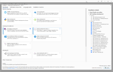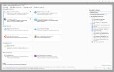
        

      </td>
    </tr>
    <tr class="even">
      <td>
        <a href="https://www.jetbrains.com/dotnet/">ReSharper Ultimate</a>
      </td>
      <td>Required</td>
      <td>
        Install the free 30-day trial, then email I.T. for access, copying your
        manager for authorization. The license includes ReSharper, dotMemory,
        dotTrace, etc.
      </td>
    </tr>
    <tr class="odd">
      <td>
        <a href="https://confy.aristocrat.com/display/MON/NuGet+Configuration"
          >NuGet Configuration</a
        >
      </td>
      <td>Required</td>
      <td>
        <ol type="1">
          <li>
Follow the guide.
</li>
          <li>
            

              Start Visual Studio 2019, open <em
                >Tools &gt; Options &gt; NuGet Package Manager &gt; Package
                Sources, </em
              >add the following required packages, and the optional packages as
              well if you plan to work without VPN access.
            

          </li>
        </ol>
        <table>
          <colgroup>
            <col style="width: 14%" />
            <col style="width: 17%" />
            <col style="width: 67%" />
          </colgroup>
          <thead>
            <tr class="header">
              <th><strong>Required?</strong></th>
              <th><strong>Name</strong></th>
              <th><strong>Source</strong></th>
            </tr>
          </thead>
          <tbody>
            <tr class="odd">
              <td>required</td>
              <td>TeamCity</td>
              <td>
                <a
                  href="http://usan-abuild-01.dev.local/guestAuth/app/nuget/feed/_Root/default/v1"
                  >http://usan-abuild-01.dev.local/guestAuth/app/nuget/feed/_Root/default/v1</a
                >
              </td>
            </tr>
            <tr class="even">
              <td>required</td>
              <td>local-packages</td>
              <td><em>/NuGetPackages</em> in your working copy</td>
            </tr>
            <tr class="odd">
              <td>required</td>
              <td><a href="http://nuget.org">nuget.org</a></td>
              <td>
                <a href="https://api.nuget.org/v3/index.json"
                  >https://api.nuget.org/v3/index.json</a
                >
              </td>
            </tr>
            <tr class="even">
              <td>optional</td>
              <td>GitHub</td>
              <td>
                <a
                  href="https://nuget.pkg.github.com/Aristocrat-Monaco-Platform/index.json"
                  >https://nuget.pkg.github.com/Aristocrat-Monaco-Platform/index.json</a
                >
              </td>
            </tr>
            <tr class="odd">
              <td>optional</td>
              <td>Visual Studio Offline Packages</td>
              <td>
                typically <em
                  >C:\Program Files (x86)\Microsoft SDKs\NuGetPackages\</em
                >
              </td>
            </tr>
          </tbody>
        </table>
        

          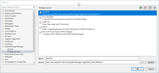
        

      </td>
    </tr>
    <tr class="even">
      <td><a href="https://tortoisesvn.net/downloads.html">TortoiseSVN</a></td>
      <td>Required</td>
      <td></td>
    </tr>
    <tr class="odd">
      <td>
        <a
          href="https://docs.microsoft.com/en-us/powershell/scripting/setup/installing-windows-powershell"
          >PowerShell 5 or later</a
        >.
      </td>
      <td>Required</td>
      <td>
        To use customized Monaco cmdlets and functions, you will need to import
        the MonacoPowerShell module: <a
          href="https://confy.aristocrat.com/display/MON/Monaco+Tools+for+PowerShell"
          >Monaco Tools for PowerShell - Monaco - Confluence (aristocrat.com)</a
        >
      </td>
    </tr>
    <tr class="even">
      <td><a href="https://tortoisegit.org/">TortoiseGit</a></td>
      <td>Optional</td>
      <td>
        Set "auto CRLF" to false during setup. Defaults should be ok for the
        rest.
      </td>
    </tr>
    <tr class="odd">
      <td>
        <a href="https://www.radblue.com/products/rgs/"
          >RadBlue G2S Scope (RGS)</a
        >
      </td>
      <td>Simulates a G2S host for EGM testing</td>
      <td>
        

          Download the free 5-day trial, then email <a
            href="mailto:support@radblue.com"
            >support@radblue.com</a
          > to ask for a license, explaining you're with Aristocrat
          Technologies.
        

        

          <strong>NOTE:</strong> G2S is used in the following VLT markets: OSL,
          IL, ALC, AGLC, and MBLL.
        

      </td>
    </tr>
    <tr class="even">
      <td>
        <a
          href="https://confy.aristocrat.com/pages/viewpage.action?pageId=100542800"
          >"Eevee" Everi Simulator</a
        >
      </td>
      <td>Simulates an Everi ("NYL Host") host for EGM testing</td>
      <td>
        
Follow the instructions or ask a team member to walk you though.

        

          <strong>NOTE:</strong> The Everi host is only used for the NYL market,
          which uses a central deterministic host.
        

      </td>
    </tr>
    <tr class="odd">
      <td>
        <a
          href="https://confy.aristocrat.com/display/GT/Video+Lottery+Terminal#VideoLotteryTerminal-PersistentStorage,SQLite,MonacoPlatform"
          >Persistent Database Viewer</a
        >
      </td>
      <td>
        Inspects the Platform's SQLite3 databases (as they can't be inspected
        with a standard SQLite3 reader).
      </td>
      <td>Follow the guide.</td>
    </tr>
    <tr class="even">
      <td>
        <a href="https://confy.aristocrat.com/display/MON/GSA+Manifest+Tool"
          >GSA Manifest Tool</a
        >
      </td>
      <td>
        Translates the Runtime/Game's configuration.xml into a GSA Manifest
        file, which the Platform can read.
      </td>
      <td>
        Follow the instructions or ask <a href="https://confy.aristocrat.com/display/~dwestbro"
          >Dietrich Westbrooks</a
        > or <a href="https://confy.aristocrat.com/display/~ca102998">Casey Anderson</a>.
      </td>
    </tr>
    <tr class="odd">
      <td><a href="https://notepad-plus-plus.org/downloads/">Notepad++</a></td>
      <td>Optional</td>
      <td>
        A useful text editor with folding, coloring and multi-file regex search.
      </td>
    </tr>
    <tr class="even">
      <td><a href="https://www.cygwin.com/">Cygwin</a></td>
      <td>Optional</td>
      <td>
        A superior shell to the Windows console for grep, Python, curl, etc.
      </td>
    </tr>
    <tr class="odd">
      <td><a href="https://getgreenshot.org/downloads/">Greenshot</a></td>
      <td>Optional</td>
      <td>A handy screenshot tool.</td>
    </tr>
    <tr class="even">
      <td><a href="https://www.goodsync.com/">GoodSync</a></td>
      <td>Optional</td>
      <td>
        A handy synchronization tool for quickly syncing two remote directory
        trees. It uses an enhanced rsync under the hood with local block hashes,
        so it can detect and skip unchanged files extremely quickly, which is
        useful if you're syncing over the VPN, e.g. between your PC and a remote
        EGM in Austin.
      </td>
    </tr>
    <tr class="odd">
      <td><a href="https://www.postman.com/downloads/">Postman</a></td>
      <td>Optional</td>
      <td>
        

          You may want to use the platform REST API to simulate some hardware
          events if you don't have physical peripherals. Some of the more
          commonly used calls are <a
            href="https://confy.aristocrat.com/pages/viewpage.action?pageId=68497783"
            >/BNA/:id/Disconnect</a
          > and <a
            href="https://confy.aristocrat.com/pages/viewpage.action?pageId=68500492"
            >/Printer/:id/Disconnect</a
          > where the ID is typically 1.
        

        

          See <a href="https://confy.aristocrat.com/display/ATLBP/Platform+APIs"
            >Platform APIs</a
          > for how to use most API calls.
        

        

          See  <a href="https://jerry.aristocrat.com/browse/ALBP-3901"
            >ALBP-3901</a
          > IN PROGRESS  for an example API call using curl, Postman and
          netstat.
        

      </td>
    </tr>
  </tbody>
</table>

## Daily Builds and Running Builds on the TeamCity Server

All Monaco platform daily builds run on the [TeamCity](http://usan-abuild-01.dev.local/login.html) server using pre-configured build agents. In addition, authorized users can launch builds on-demand.

**Team City Server URL**

-   [http://usan-abuild-01.dev.local](http://usan-abuild-01.dev.local/)

**Build Version**

The daily build will update the assembly info to reflect the built version. It follows the format of ***Major.Minor.Patch.BuildNumber*** (for details, see [Build and Release Versioning](https://confy.aristocrat.com/pages/viewpage.action?pageId=132416792#StepsforBuildingandRunningtheMonacoPlatform-BuildandReleaseVersioning) below). The first three components are controlled via a parameter in the build server. The last component is maintained by the build server and is auto-incremented.  To see more information about the TeamCity build numbers, go here: [Documentation - Monaco Versioning and Branch Naming](https://confy.aristocrat.com/display/MON/Documentation+-+Monaco+Versioning+and+Branch+Naming)

The platform log now contains the version as reflected in the assembly info.

**<u>Build Tagging</u>**

The build server has the ability to create an SVN tag during a build.  When running a custom build from TeamCity checking the ***Tag Build*** check box will create a tag in svn with version number of the build

 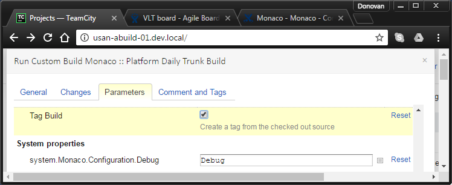

### Build and Release Versioning

Monaco uses a standard **four-digit** versioning pattern for its releases.  (#.#.#.#).
-   1st Number - Monaco Platform 'Major' version.
-   2nd Number - Monaco Platform 'Minor' version.
-   3rd Number - Monaco Platform 'Patch' revision.
-   4th Number - Monaco Platform build number, which changes the most often, sometimes daily along with every build iteration.

For example, the latest NYL release to pre-cert 2 (PC2):

**2.5.0.11**

See also:

-   [Documentation - Monaco Versioning and Branch Naming - Monaco - Confluence (aristocrat.com)](https://confy.aristocrat.com/display/MON/Documentation+-+Monaco+Versioning+and+Branch+Naming)

-   [Documentation - TeamCity Version Numbering - Monaco - Confluence (aristocrat.com)](https://confy.aristocrat.com/display/MON/Documentation+-+TeamCity+Version+Numbering)

## Building and Running Monaco Locally

Once you've tooled up, here's a quick guide to checkout and run the build of Platform, Runtime, and Games.

### Setup Video

**NOTE: **Platform will **only** run if on a laptop with an nVidia graphics card.

To ensure optimal graphics performance, right-click on the desktop, open *nVidia Control Panel*, and select "High-performance NVIDIA processor" as shown below.

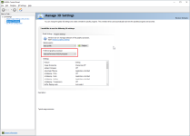

### Checkout and Build the Platform

1.  In TortoiseSVN or SVN, checkout the latest Monaco platform trunk source from <https://svn.ali.global/PlatformArchitecture/Monaco/Trunk> (5 to 10 minutes).
2.  In your working copy, shift-right click on *noanalysisdev.bat* and *Run as Administrator*, which opens the solution in Visual Studio with advanced code analysis disabled, to make code navigation and builds more simpler.
3.  Build the solution in Visual Studio (about 2 minutes).

### Known Platform Build Issues and Workarounds

-   Platform will **only** run if on a laptop with an nVidia graphics card.

### Download Runtime and Game(s)

**NOTE:** The example below is for the New York Lottery jurisdiction project. Contact your manager to determine which project folder(s) you should be working from.

1.  In your working copy, create a *bin\\Debug\\Platform\\packages* folder.
2.  Go to [Monaco on TeamCity](http://usan-abuild-01.dev.local/project/Monaco?mode=builds#all-projects) *&gt; New York Lottery > Composite (Trunk + GDK 3.0 NYL Games*), then select the most recent revision, then* Artifacts, *then open *Platform > Packages, *[e.g. Here.](http://usan-abuild-01.dev.local/buildConfiguration/Monaco_NewYorkLottery_CompositeGdk30/43140?buildTab=artifacts#%2FPlatform%2Fpackages)
3.  Download all *Runtime* ISOs you see, and the *Buffalo Gold Revolution* ISO, to your new *packages* folder as shown in the screenshot below. The game is a large file that may take several hours to download.

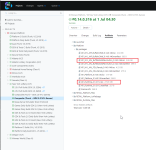

### Set Up the Platform on Local Machine (virtual EGM)

**NOTE:** The example below is for the New York Lottery jurisdiction project. Contact your manager to determine which project folder(s) you should be working from.

1.  Open a console window to *yourworkingcopy\\bin\\Debug\\Platform\\bin.*
2.  Run: Bootstrap.exe display=windowed showTestTool=true showMouseCursor=true ignoreTouchCalibration DisplayFakePrinterTickets=true readonlymediaoptional=true
3.  In the Monaco setup, select the "NewYork-VLT" jurisdiction, "Test" protocol, fake devices for both note acceptor and printer, and defaults for the remaining pages. (See [Auto Configuration - Aristocrat VLT Platform](https://confy.aristocrat.com/display/MON/Auto+Configuration+-+Aristocrat+VLT+Platform) for information about auto-configuring the platform so you won't have to perform these steps every time)
4.  When the touchscreen calibration screen appears, press the spacebar to dismiss (once per monitor).
5.  Setup is now complete.

Also see [Command Line Arguments](https://confy.aristocrat.com/display/MON/Command+Line+Arguments).

### Run the Platform on Local Machine (virtual EGM)

1.  Run the above Bootstrap.exe command again. This time, the platform will launch the game and other screens that reflect a real EGM.
2.  Press *F9* to enter shortcut mode*, 7* to insert $1 into the virtual EGM, then *spacebar* a few times to play some rounds!
3.  Press *F1* to open the Audit Menu and explore its pages/settings.
4.  To close the Platform, click the shell window's close button, or Ctrl-C in your console.

See the other useful shortcuts in [Keyboard Commands](https://confy.aristocrat.com/display/MON/Keyboard+Commands). You can also add new shortcuts to keyboardActions.json or KeyConverter.BuildKeyMapping() bound to custom events, e.g.:

{ Keys.F3, (type: typeof(Printer.DisconnectedEvent), args: new List&lt;object> { 0 }) },  
{ Keys.F4, (type: typeof(Printer.ConnectedEvent), args: new List&lt;object> { 0 }) },

### Reset the Platform

To reset the Platform:

-   Remove its persisted state (SQLite3 databases) and logs by deleting all folders under *bin\\Debug\\Platform, *except *bin* and *packages*.
-   Remove its Runtime/game ISO mounts by deleting *bin\\Debug\\Games *and *bin\\Debug\\Runtime* (only required if switching Runtime and/or game ISOs).

The Platform will start the setup process again the next time you run it.

## Set Up and Run on Real EGM Hardware

First, you will need to locate the appropriate EGM system to run on. Depending on your project and location, you may or may not have a machine dedicated for use, so ask your manager for details. For the Austin projects, we have a pool of EGMs online. For example, here is the list of all the Austin EGMs, configuration, and use allocation: [Austin EGMs available for Development Work - Monaco - Confluence (aristocrat.com)](https://confy.aristocrat.com/display/MON/Austin+EGMs+available+for+Development+Work).

### Install VNC Client on Local PC

1.  Download TightVNC <https://www.tightvnc.com/download/2.8.27/tightvnc-2.8.27-gpl-setup-64bit.msi>
2.  Run the installer
3.  Accept GNU license agreement
4.  Choose Setup Type "Custom"
5.  Disable install of TightNVC Server (only the VNC Client is needed)
6.  Complete the installation, "Next", "Continue", etc.

### Remote Desktop into EGM using VNC

**Note:** For most sites, you must be on the VPN Gateway associated with your EGM pool.

1.  **To access the Austin EGM pool:** You must be on the Austin, TX Global Protect VPN
2.  Run TightVNC Viewer application
3.  Enter {IP\_ADDRESS}::5900 for "Remote Host"
4.  Click "Connect"

### Download to the EGM and Run the Monaco Platform

#### Download from TeamCity

1.  From the EGM open a browser and log into TeamCity
2.  Navigate to the appropriate jurisdiction/build tree (for example NYL): 
3.  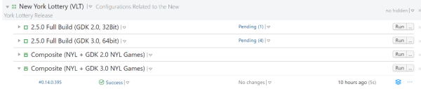
4.  Select and download the artifacts .zip to the EGM *D:\\* drive:
5.  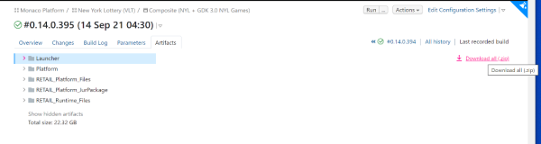
6.  Extract the .zip file and choose *Aristocrat-VLT* folder to extract the .zip contents:
7.  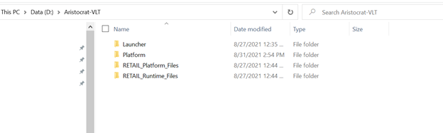
8.  Navigate to *D:\\Aristocrat-VLT\\Platform\\Packages* folder and validate that the platform, runtime, game, .iso and manifest files and the license are available.
9.  

### Run the Platform

1.  Go to *D:\\Aristocrat-VLT\\Launcher*
2.  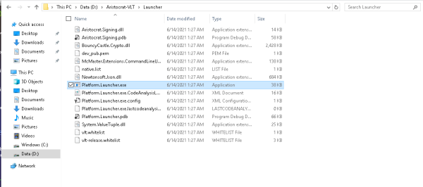
3.  From the Launcher folder using command line or PowerShell, run Platform.Launcher.exe with your choice of arguments. For example: .\\Platform.Launcher.exe display=windowed showTestTool=true showMouseCursor=true ignoreTouchCalibration DisplayFakePrinterTickets=true 
4.  Monaco shell will start up:
5.  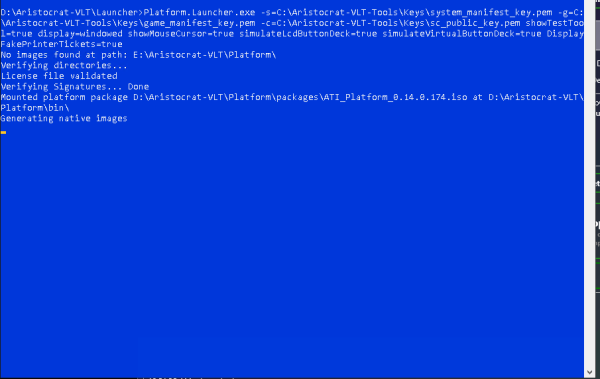
6.  After Monaco loads, the Configuration Wizard will prompt you to begin the initial configuration process:
7.  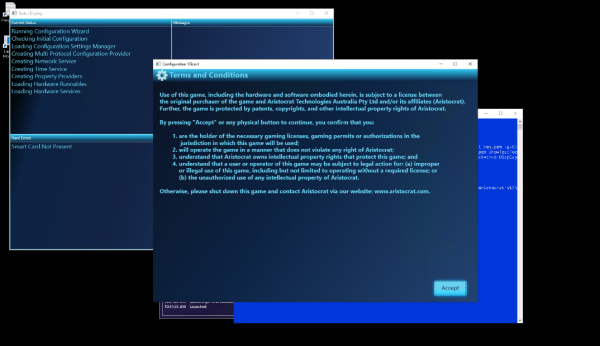

### Troubleshooting and Typical Commands

#### HELP! I can't get passed touch calibration

Add the "ignoreTouchCalibration" command line flag when executing Bootstrap.exe. Then simply press "Enter" to skip through the Touch Calibration screens.

Below are a few more useful Bootstrap.exe options:

Depending on screen resolution, it can be hard to see the mouse cursor once you launch the platform, so use the below to make life easier:
-   showMouseCursor=true
If you are doing screen captures on a live EGM, you will want to be in windowed display mode to make it easier to resize the screens and move back and forth between Windows and the platform screens:
-   display=windowed

#### After remoting into EGM, no desktop icons are shown, everything is black

It could be in developer mode with the default black Windows wallpaper. Try zooming in close and right click. Can you create a new folder?

If not, this can happen when the EGM is turned on but **not** in Windows Shell mode. 

1.  To enable Windows Shell mode, open Task manager and Run explorer.exe. To do this, open Windows Remote Desktop and remote-in
2.  It should prompt for credentials. Enter the normal generic EGM username & password
3.  Enter Fullscreen mode on Remote Desktop to properly capture all keyboard input
4.  Press Ctrl-Shift-Esc to open Task manager
5.  File > Run New Task > type "Explorer.exe" and click "Ok"
6.  Run D:\\VLT\_Helper\_Commands\\Windows-Shell\_Activate.cmd
7.  Reboot EGM. It should now boot into the Standard Windows Shell

#### After Pressing "Connect" in VNC Viewer, nothing happens

This will occur when the viewer is unable to connect to VNC Server on the EGM. 
-   The TightVNC server may not be running on the EGM. It should auto-start on system startup, but server may have been stopped
-   TightVNC Server is not Installed on EGM
-   You are not on the Austin VPN, so you do not have access to the EGMs at the office

## JIRA/TXM Ticket Lifecycle

**NOTE:** All new Monaco projects past NYL, including HHR and WWR.x are using the TXM process.

Now that you can edit and run the Platform code, here's a brief summary of how to fix a Jira ticket. These steps may seem tedious initially, but only take a few minutes per Jira with a bit of practice.

For simplicity, let's assume you're fixing an issue on trunk (the typical case), thus it will be the *parent branch* in the instructions below.

Please also read the coding standards and code review process in detail in the links at the top of this page.

**Pro tips:**

-   To see your working copy's current branch without a console, right-click on your working copy in Explorer, then *Properties > Subversion > URL*.
-   To see your current revision on that branch, *TortoiseSVN > Show log*, then find the emboldened line.

### Start the Ticket and Topic Branch

1.  Open the Jira and click *In Progress*.
2.  Create a topic branch for your ticket:
    1.  *TortoiseSVN > Switch* your working copy to the parent branch (e.g. <https://svn.ali.global/PlatformArchitecture/Monaco/Trunk>) if not already there.
    2.  *TortoiseSVN > Branch/Tag*.
    3.  In *To path*, use our conventional format which includes your name and the Jira, e.g. <https://svn.ali.global/PlatformArchitecture/Monaco/Branches/Development/ggallant/VLT-14560>; click *Ok*.
3.  *TortoiseSVN > Switch* to your new branch.  
    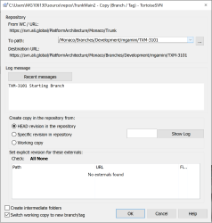

### Fix and Update the Topic Branch

1.  Work on the issue, making commits to your topic branch as you see fit. I suggest prefacing your commit messages with the ticket (e.g. VLT-14560) so you can differentiate between your work and merges later.
2.  If your topic branch is long running and falls behind its parent branch, you may want to occasionally merge the parent branch (e.g. trunk) into your topic branch as follows:
    1.  *TortoiseSVN > Merge > Merge a range of revisions*.
    2.  Select the parent branch as *URL to merge from*. Leave defaults for the rest (specific range with an empty textbox).
    3.  If you get a "mixed revision" error on the merge, it's probably due to your externals being behind your branch. Select the *Update* option, then continue the merge.
    4.  Commit to your branch with a suitable message like "merged from trunk".

### Raise and Resolve the Code Review

When your code is ready for review:

1.  Browse to the [Monaco Platform on UpSource](http://usan-abuild-01.dev.local:8080/monaco-platform-development-branches).
2.  Wait for the first material commit in your branch to appear and turn blue, which indicates that UpSource has indexed the commit from SVN. Then click *Create Code Review Request.*
3.  Click *Add Revisions* and cherry-pick the revisions from your topic branch you want to be reviewed.
4.  Update the Jira issue with the URLs for the branch and code review, a summary of your changes, screenshots, any manual/automated tests you did, notes for QA and so forth. See [VLT-18585](https://jerry.aristocrat.com/browse/VLT-18585) for an example.
5.  Invite others to review/monitor according to [Code Review Guidelines](https://confy.aristocrat.com/display/MON/Code+Review+Guidelines).
6.  Continue committing to your topic branch (and add those revisions to your review).
7.  Once all reviewers have accepted your changes, close the review.

### Commit to the Parent Branch

Once all reviewers have accepted your changes and your review is closed, your code is ready to be committed to its parent branch:

1.  *TortoiseSVN > Switch* your working copy back to the parent branch.
2.  *TortoiseSVN > Merge > Merge a range of revisions*.
3.  Select your topic branch as *URL to merge from*.
4.  Select *Specific Range*, and in the textbox, enter only the revisions material to your patch (not merges from trunk or other branches).
5.  Leave defaults for the other options.

Review the patch one last time, then commit with a commit message in the following format that includes the Jira and code review:

VLT-12345: brief description (suitable for someone browsing the SVN history)  
Jira: https://jerry.aristocrat.com/browse/VLT-12345  
review: http://usan-abuild-01.dev.local:8080/monaco-platform-development-branches/review/MPDB-CR-1224  
additional details...

### Merge to Other Affected Branches

Sometimes your Jira will include other branches (typically releases) in its *Fix Versions* list that are also affected. You may have to merge your changes to that branch; and the merge complexity will depend on the divergence of the other branch from your original parent branch, and other factors.

Reach out to [Cory Mayberry](https://confy.aristocrat.com/display/~cmayberr) or a colleague for guidance.

### Finish the Jira

In the Jira, click *Verify*, select the resolution (Fixed, No Fix Required, etc.) and mention the revision in the parent branch to which you committed.
