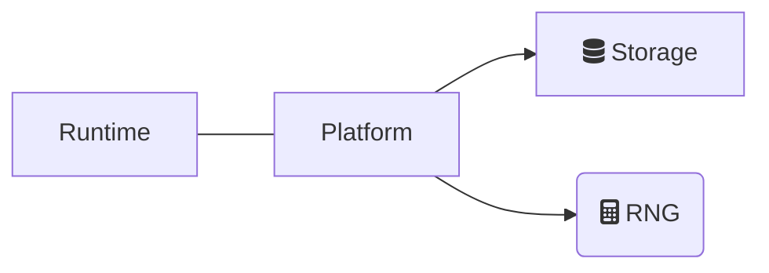
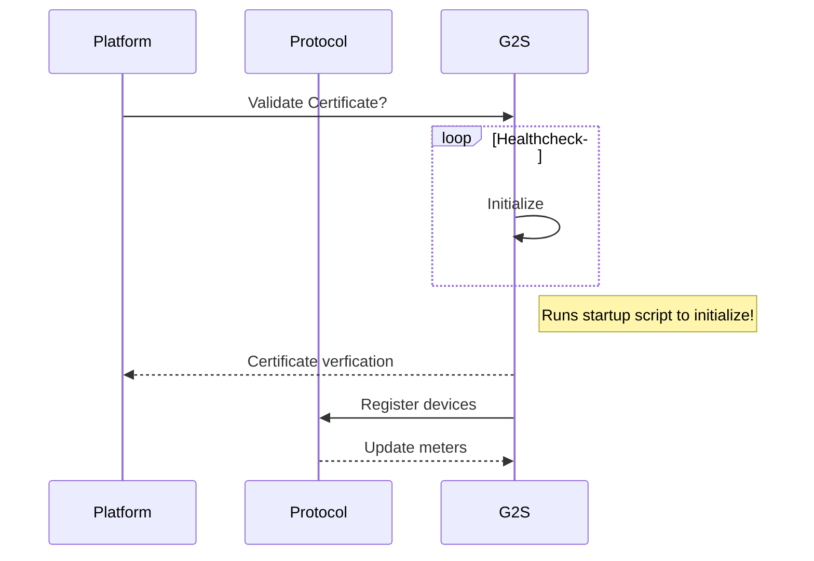

Overview
========

<!-- @import "[TOC]" {cmd="toc" depthFrom=1 depthTo=6 orderedList=false} -->

<!-- code_chunk_output -->

- [Summary](#summary)
- [Generating documentation from code](#generating-documentation-from-code)
- [Generating documentation from Markdown files](#generating-documentation-from-markdown-files)
  - [Example of adding Markdown documentation file](#example-of-adding-markdown-documentation-file)
  - [Including HTML, images, and diagrams in your documentation](#including-html-images-and-diagrams-in-your-documentation)
  - [Example FontAwesome icons](#example-fontawesome-icons)
  - [Example Mermaid Diagram](#example-mermaid-diagram)
  - [Example Mermaid Sequence Diagram](#example-mermaid-sequence-diagram)
  - [Example PlantUML Use Case Diagram](#example-plantuml-use-case-diagram)
  - [Working with Markdown files](#working-with-markdown-files)

<!-- /code_chunk_output -->

# Summary
Monaco documentation is stored in the repository along side the code in a "Documentation" sub-folder. There are two sources for the documentation, Markdown files and XML documentation in the code. <a href="https://dotnet.github.io/docfx" target="_blank">DockFX</a> is used to generate HTML files from XML comments. The Markdown files should be placed in the "Documentation\docs" sub-folder in the structure that the page will appear on the menu tree.

# Generating documentation from code
Code should be properly documentated following the <a href="https://docs.microsoft.com/en-us/dotnet/csharp/language-reference/xmldoc" target="_blank">XML documentation comment</a> standard. Use this <a href="https://blog.rsuter.com/best-practices-for-writing-xml-documentation-phrases-in-c" target="_blank">XML documentation comment cheat sheet</a> for XML documentation best practices.

Example:
``` csharp
/// <summary>
///     This is a sample class to demonstrate proper code documentation.
/// </summary>
public class TextWriteSample
{
    /// <summary>
    ///     Initializes a new instance of the <see cref="TextWriteSample" class.
    /// </summary>
    /// <param name="denom">The denom of the game round.</param>
    public TextWriteSample(string text)
    {
        Text = text;
    }

    /// <summary>
    ///     Gets or sets the text to display.
    /// </summary>
    public string Text { get; set; }

    /// <summary>
    ///     This method will display the value of the Text property.
    /// </summary>
    /// <returns>If successful returns true, otherwise false.</returns>
    public bool DisplayText()
    {
        // TODO: Display text
    }
}
```

The XML comments in the code snippet above will be used to generate API documentation in HTML that will be deployed to the Monaco website.

# Generating documentation from Markdown files
Markdown files should be placed in the "Documentation\docs" sub-folder in the same structure that it will be listed in the TOC. A reference to the file is then placed in the "Documentation\docs\toc.yml" file. The toc.yml (Table of Contents) file will be parsed into an HTML tree menu that will be used to navigate to the HTML page.
<br />

## Example of adding Markdown documentation file
```bash
docs
├── design
│   └── new-design.md
├── toc.yml
```

**toc.yml:**
```yaml
- name: Overview
  href: index.md
- name: Design
  items:
    - name: New Design
      href: design/new-design.md
```

## Including HTML, images, and diagrams in your documentation
Images and HTML can be included in Markdown files. Images need to be placed in the "Documentation\images" folder in the same structure as the Markdown file.

```bash
docs
├── design
│   └── new-design.md
images
├── design
│   │── new-design
│   │   └── image1.png
```

:warning: It is preferable not to use images as that will bloat the source repository. Mermaid and PlantUML offer a variety of diagramming options that should cover most documentation visualization needs.

You can also use <a href="https://fontawesome.com" target="_blank">FontAwesome</a> icon fonts (limited to free icons).
<br />
<br />

## Example FontAwesome icons
<p>
    <span class="fa fa-spinner fa-spin"></span>
    <span class="fa fa-circle"></span>
    <span class="fa fa-database"></span>
</p>

```html
<p>
    <span class="fa fa-spinner fa-spin"></span>
    <span class="fa fa-circle"></span>
    <span class="fa fa-database"></span>
</p>
```

Mermaid and PlantUML diagrams can also be embedded in the Markdown pages. FontAwesome icon fonts can be used in Mermaid diagrams -- see example below.
<br />
<br />

## Example Mermaid Diagram


````Markdown

````
<br />

## Example Mermaid Sequence Diagram


````Markdown

````

See <a href="https://mermaid-js.github.io/mermaid" target="_blank">Mermaid</a> website to learn more.

## Example PlantUML Use Case Diagram
```plantuml
skinparam backgroundcolor transparent
actor Technician
node Platform
database Storage

Storage -> Platform
Platform -> Technician
```

````Markdown
```plantuml
skinparam backgroundcolor transparent
actor Technician
node Platform
database Storage

Storage -> Platform
Platform -> Technician
```
````

See <a href="https://plantuml.com/" target="_blank">PlantUML</a> website to learn more.

## Working with Markdown files
There are several options for editing Markdown. The recommended approach is to use <a href="https://code.visualstudio.com" target="_blank">VSCode</a> with the <a href="https://marketplace.visualstudio.com/items?itemName=shd101wyy.markdown-preview-enhanced" target="_blank">Markdown Preview Enhanced</a> extension. This extension allows you to view the Markdown in a preview window in VSCode. It also supports PlantUML, Mermaid, FontAwesome (limited to free icons), and adding/updating table of contents.

You may also need to install <a href="https://marketplace.visualstudio.com/items?itemName=jebbs.plantuml" target="_blank">PlantUML</a> extension for VSCode.
